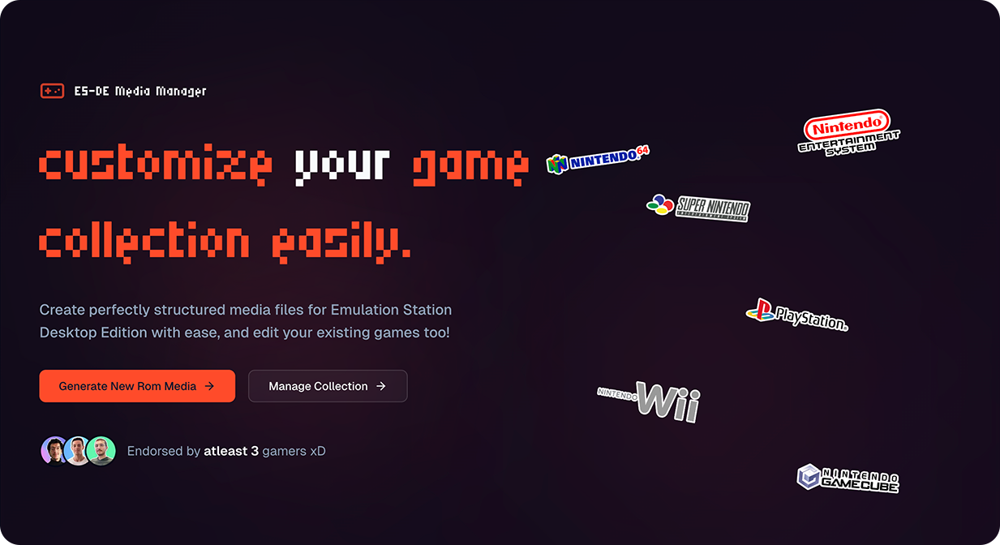

<div align="center">

**🎮 The Ultimate Media Management Tool for Emulation Station Desktop Edition**

[](https://esde-manager.ashref.tn/) [](https://github.com/Ashref-dev/es-de-custom-cover-generator) [](#-100-client-side-processing)

[](https://nextjs.org/) [](https://www.typescriptlang.org/)

</div>

---

## 🎯 The Problem

Managing media files for **Emulation Station Desktop Edition (ES-DE)** can be frustrating:

- 🔍 **Poor Scraping Results**: Screen scrapers often return low-quality or incorrect images
- 📁 **Complex File Management**: Manually organizing files into correct folder structures
- 🖼️ **No Visual Management**: Difficult to preview and manage your game media collection
- 💾 **File System Complexity**: Copying/pasting files manually into nested directories
- 🎨 **Limited Customization**: Hard to replace or update game covers, logos, and videos
- 📱 **No User-Friendly Interface**: Existing tools require technical knowledge

## ✨ The Solution

**ES-DE Media Manager** is a modern, web-based tool that makes managing your retro game collection effortless:

## 🚀 Key Features

### 🎯 Core Features

- **�️ Drag & Drop Interface**: Simply drag images/videos or paste URLs
- **🎨 Visual Media Management**: Preview all media types in an intuitive interface
- **🔧 Built-in Optimization**: Optional image compression to save storage space
- **🔒 100% Private**: All processing happens locally - your files never leave your device
- **🆓 Completely Free**: Open source and free to use forever
- **🌐 No Installation Required**: Works directly in your web browser

### 🔍 Direct File System Integration

- **Browser Folder Access**: Grant permission to your ES-DE media folder directly in the browser
- **Automatic Updates**: Changes are applied instantly to your existing media library
- **Real-time Sync**: No file copying or manual organization required
- **Smart Detection**: Automatically detects existing games and media structure

### � **Direct File System Integration**

- **Browser Folder Access**: Grant permission to your ES-DE media folder directly in the browser
- **Automatic Updates**: Changes are applied instantly to your existing media library
- **Real-time Sync**: No file copying or manual organization required
- **Smart Detection**: Automatically detects existing games and media structure

### 🎮 **Supported Media Types**

- **Box Art / Covers**: Game box art and cover images
- **Logos / Marquees**: Game logos and title graphics
- **Screenshots**: In-game screenshots
- **3D Boxes**: 3D rendered box art
- **Title Screens**: Game title screens
- **Videos**: Game preview videos and trailers
- **Fan Art**: Custom fan-created artwork
- **Physical Media**: Disc/cartridge images

### 🏆 **Supported Platforms**

Supports **50+ gaming platforms** including:

- Nintendo (NES, SNES, N64, GameCube, Wii, Switch)
- PlayStation (PS1, PS2, PS3, PS4, PS5, PSP, Vita)
- Xbox (Original, 360, One, Series X/S)
- Sega (Genesis, Saturn, Dreamcast, Game Gear)
- Arcade (MAME, FinalBurn Neo, Capcom, SNK)
- And many more retro systems!

---

## 🌟 How It Works

### 1. **Generator Mode**

Create new media collections from scratch:

- Upload your media files (drag & drop or paste URLs)
- Select your gaming platform and organize files
- Generate perfectly structured ES-DE media folders
- Grant browser access to your ES-DE `downloaded_media` folder
- Files are automatically placed in the correct locations

### 2. **Browse Mode**

Manage your existing ES-DE media collection with direct file system integration:

#### 📂 **Getting Started with Browse Mode**

1. **Navigate to your ES-DE media folder**:
   - On macOS: `~/ES-DE/downloaded_media`
   - On Windows: `%USERPROFILE%\ES-DE\downloaded_media`
   - On Linux: `~/.emulationstation/downloaded_media`

2. **Grant folder access**:
   - Click "Browse Collection" in the app
   - Select your `downloaded_media` folder (not individual console folders)
   - Accept the browser permission dialog

3. **Manage your collection**:
   - Preview all media types in an intuitive interface
   - Replace, update, or add new media files instantly
   - Changes are automatically saved to the correct locations
   - No manual file copying or organization required

> ⚠️ **Important**: Make sure to select the main `downloaded_media` folder, not individual console folders within it.

---

## 🚀 Quick Start

### Option 1: Use the Web App (Recommended)

**👉 [Open ES-DE Media Manager](https://esde-manager.ashref.tn/)**

No installation required! Works in any modern web browser.

#### For Browse Mode:

```
1. Navigate to your ES-DE media folder:
   • macOS: ~/ES-DE/downloaded_media
   • Windows: %USERPROFILE%\ES-DE\downloaded_media
   • Linux: ~/.emulationstation/downloaded_media

2. Click "Browse Collection" and select the downloaded_media folder
3. Grant browser permission when prompted
4. Start managing your media collection!
```

### Option 2: Run Locally

```bash
# Clone the repository
git clone https://github.com/Ashref-dev/es-de-custom-cover-generator.git
cd es-de-custom-cover-generator

# Install dependencies
bun install

# Start development server
bun run dev

# Open http://localhost:3000
```

---

## 🔒 100% Client-Side Processing

Your privacy is our priority:

- ✅ **No Server Uploads**: Files are processed entirely in your browser
- ✅ **No Data Collection**: We don't collect or store any personal information
- ✅ **Offline Capable**: Works without an internet connection (after initial load)
- ✅ **No Registration**: Use immediately without creating accounts
- ✅ **Open Source**: Fully transparent code you can audit yourself

---

## 🛠️ Development

### Tech Stack

- **Framework**: Next.js 15 with App Router
- **Language**: TypeScript
- **Styling**: Tailwind CSS
- **UI Components**: Radix UI + shadcn/ui
- **File Processing**: Web APIs (FileSystem, Canvas, etc.)
- **Image Optimization**: Built-in image compression
- **Build Tool**: Turbopack

### Project Structure

```
├── app/                 # Next.js app router pages
├── components/          # React components
│   ├── browser/        # Browse mode components
│   └── ui/             # UI component library
├── lib/                # Utilities and constants
├── public/logos/       # Platform logos
└── types/              # TypeScript definitions
```

### Development Commands

```bash
bun run dev             # Start development server
bun run build           # Build for production
bun run lint            # Run ESLint
bun run format          # Format with Prettier
bun run dev:debug       # Start with debugger attached
```

---

## 🤝 Contributing

We welcome contributions! Here's how you can help:

1. **🐛 Report Issues**: Found a bug? [Open an issue](https://github.com/Ashref-dev/es-de-custom-cover-generator/issues)
2. **💡 Suggest Features**: Have an idea? [Start a discussion](https://github.com/Ashref-dev/es-de-custom-cover-generator/discussions)
3. **🔧 Submit Pull Requests**:
   - Fork the repository
   - Create a feature branch
   - Make your changes
   - Submit a pull request

### Development Setup

1. Fork and clone the repository
2. Install dependencies: `bun install`
3. Start development server: `bun run dev`
4. Make your changes and test
5. Submit a pull request

---

## 📸 Screenshots

<details>
<summary>🖼️ Click to view screenshots</summary>

### Home Page


### Generator Mode


### Browse Mode


### Media Management


</details>

---

## ❤️ Support the Project

If you find this project helpful:

- ⭐ **Star the repository** to show your support
- 🐛 **Report issues** to help improve the tool
- 🔄 **Share with others** in the retro gaming community
- 💡 **Contribute features** or improvements
- ☕ **[Buy me a coffee](https://ashref.tn)** to fuel more development

---

## 📄 License

This project is licensed under the **MIT License** - see the [LICENSE](LICENSE) file for details.

---

## 👨‍💻 About the Author

**Ashref Ben Abdallah**

- 🌐 Website: [ashref.tn](https://ashref.tn)
- 🐙 GitHub: [@Ashref-dev](https://github.com/Ashref-dev)
- 🎮 Passionate retro gaming enthusiast and developer

---

## 🙏 Acknowledgments

- **EmulationStation Desktop Edition** team for creating an amazing frontend
- The **retro gaming community** for inspiration and feedback
- **Open source contributors** who make projects like this possible
- **Beta testers** who helped shape the user experience

---

<div align="center">

**🎮 Happy Gaming! 🎮**

_Made with ❤️ for the retro gaming community_

[](https://esde-manager.ashref.tn/)

</div>
