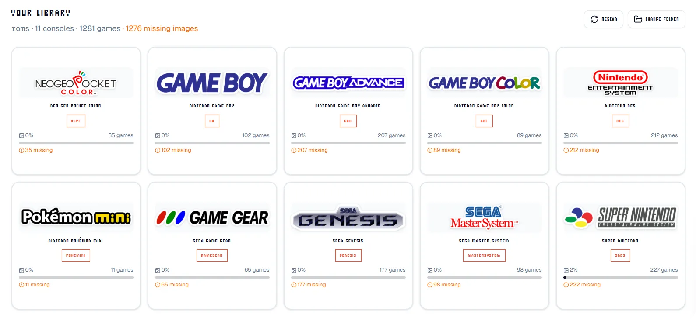

<div align="center">
  
</div>

# ES Media Manager

A web-based tool for managing game covers, logos, screenshots, and videos on retro handheld SD cards.

Built for devices running **ArkOS**, **ROCKNIX**, **JELOS**, or other EmulationStation-based firmware (R36S, RG35XX, RG503, etc.).

> This is **not** tested on many devices, edge cases may reveal bugs, proceed with caution!

## What it does

- **Scan your SD card** — auto-detects console folders and parses `gamelist.xml` files
- **See what's missing** — shows which games have covers, logos, screenshots, and videos
- **Fetch artwork** — searches [ScreenScraper.fr](https://www.screenscraper.fr/) for covers, logos, screenshots, and videos
- **Edit metadata** — fix game names, descriptions, ratings, and more
- **Save directly** — writes changes back to your SD card

Everything runs in your browser. No uploads, no accounts, no data collection.

## Quick start

```bash
git clone https://github.com/AhmedBenAbdallahDev/es-cover-manager.git
cd es-cover-manager
bun install
cp .env.example .env.local
bun run dev
```

Open http://localhost:3000

## Environment variables

Create a `.env.local` file:

```env
SCREENSCRAPER_DEVID=your_developer_id
SCREENSCRAPER_DEVPASSWORD=your_developer_password
```

Never commit `.env.local` — it's already in `.gitignore`.

## How it works

1. **Open your SD card** — click "Open SD Card" and select the root folder
2. **Auto-scan** — detects all console folders and reads gamelists
3. **Browse your library** — see which games have artwork and which don't
4. **Fetch or upload** — use ScreenScraper to find artwork, or upload your own
5. **Save changes** — writes directly to your SD card

## Supported media types

| Type | Description |
|------|-------------|
| Box Art / Covers | Main cover art |
| Wheel / Marquee | Game logo |
| Video Snap | Gameplay video |
| Screenshot | In-game screenshot |
| Thumbnail | Smaller preview |

## Supported consoles

100+ systems including NES, SNES, N64, GBA, DS, PS1, PS2, PSP, Genesis, Saturn, Dreamcast, MAME, Neo Geo, and many more. See `lib/constants.ts` for the full list.

## Tech stack

- Next.js 16 (App Router)
- TypeScript (Strict Mode)
- Tailwind CSS
- Radix UI + shadcn/ui
- Bun (package manager)
- Turbopack (build tool)

## Development commands

```bash
bun run dev       # Start development server
bun run build     # Build for production
bun run format    # Format with Prettier
```

## Project structure

```
app/              # Next.js app router pages and API routes
components/       # React components (browser, scraper, ui)
hooks/            # Custom React hooks
lib/              # Utilities, constants, API clients
types/            # TypeScript type definitions
public/           # Static assets
```

## Contributing

1. Fork the repository
2. Create a feature branch
3. Make your changes
4. Submit a pull request

## Credits

Inspired by [Ashref-dev's ES-DE Custom Cover Generator](https://github.com/Ashref-dev/es-de-custom-cover-generator). This is a separate project adapted for retro handhelds.

## License

MIT
